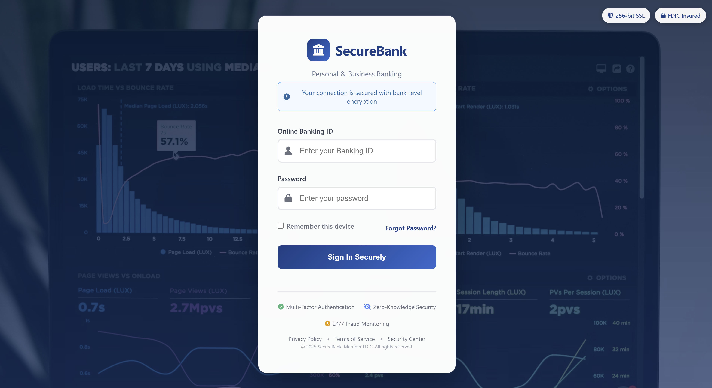
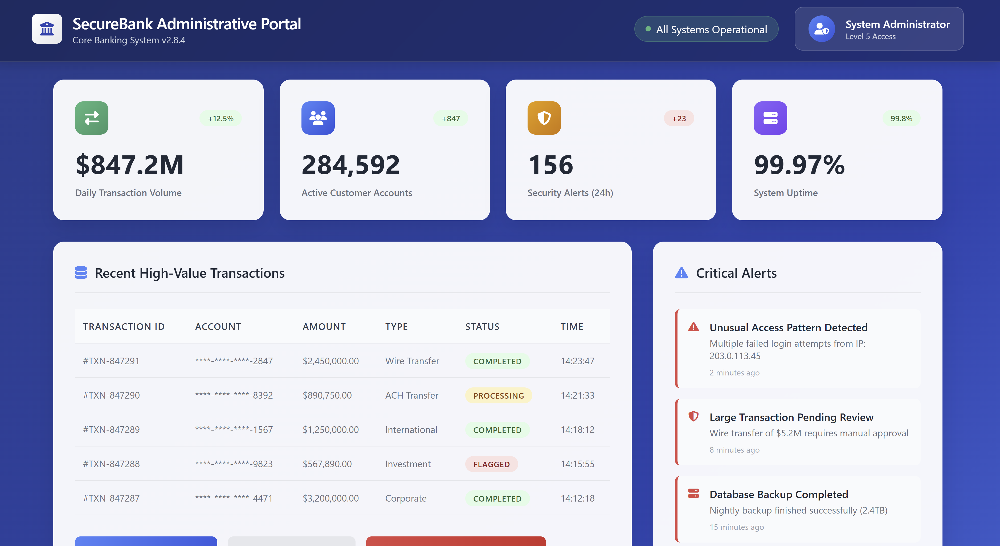
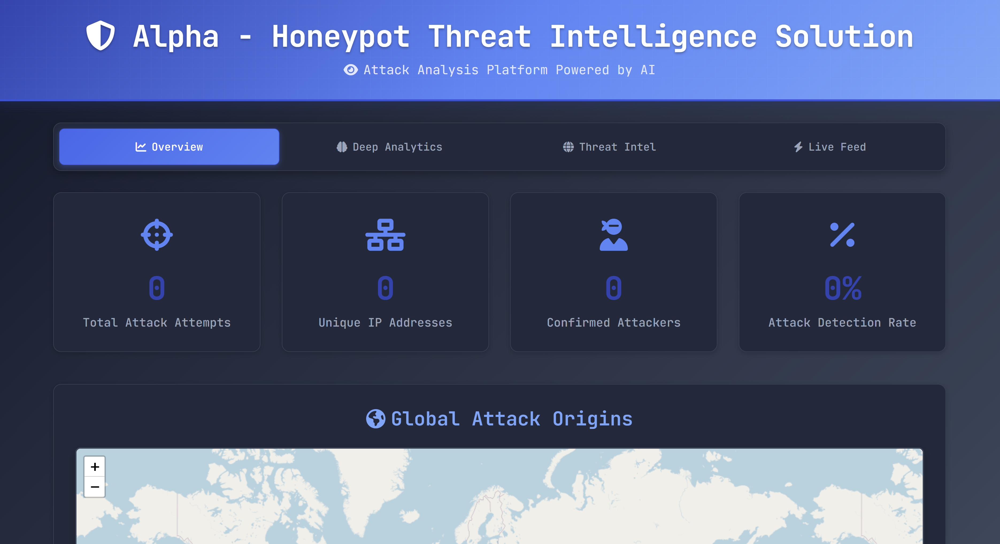

# Alpha - Honeypot Threat Intelligence Solution

[](https://www.python.org/downloads/)
[](https://opensource.org/licenses/MIT)
[](https://flask.palletsprojects.com/)

A machine learning-powered honeypot that detects and tracks malicious login attempts with real-time geolocation mapping and threat analysis.

## Screenshots

### Fake Banking Login Interface
The honeypot presents attackers with a convincing financial institution login page:



### Fake Administrative Panel
Detected attackers are redirected to a realistic admin interface to study their behavior:



### Real-Time Analytics Dashboard
Monitor attacks in real-time with geographic visualization and threat intelligence:



## Features

- **AI-Powered Threat Detection**: K-means clustering to classify normal users vs. attackers
- **Real-Time Geolocation**: Track attack origins worldwide with interactive mapping
- **Adaptive Learning**: Automatically retrain ML model as new attack patterns emerge
- **Deceptive Admin Panel**: Fake interface to trap and study attacker behavior
- **Analytics Dashboard**: Live attack visualization and statistics
- **Attack Intelligence**: Comprehensive logging and analysis of attack patterns

## Tech Stack

- **Backend**: Python Flask
- **Machine Learning**: Scikit-learn (K-means clustering)
- **Frontend**: HTML5, CSS3, JavaScript
- **Mapping**: Leaflet.js with OpenStreetMap
- **Geolocation**: IP-API service
- **Data Storage**: CSV logging with JSON caching

## Prerequisites

- Python 3.8 or higher
- pip (Python package manager)
- Internet connection (for IP geolocation)

## Quick Start

### Automatic Setup (Recommended)

1. **Clone the repository**
   ```bash
   git clone https://github.com/ApexProgrammer/alpha.git
   cd alpha
   ```

2. **Install dependencies**
   ```bash
   pip install -r requirements.txt
   ```

3. **Run the setup script**
   ```bash
   python setup.py
   ```

4. **Start the honeypot**
   ```bash
   python app.py
   ```

### Manual Setup

1. **Clone the project**
   ```bash
   git clone https://github.com/ApexProgrammer/alpha.git
   cd alpha
   ```

2. **Install dependencies and initialize**
   ```bash
   pip install -r requirements.txt
   cp .env.example .env
   python setup.py
   python app.py
   ```

## Access Points

- **Honeypot Login**: `http://localhost:5000`
- **Analytics Dashboard**: `http://localhost:5000/dashboard`
- **Fake Admin Panel**: `http://localhost:5000/admin` (for trapped attackers)

## Configuration

Copy `.env.example` to `.env` and customize:

```env
SECRET_KEY=your-secret-key-here
HOST=127.0.0.1
PORT=5000
DEBUG=False
RETRAIN_THRESHOLD=10
LOG_FILE=logs.csv
MODEL_FILE=honeypot_model.pkl
IP_CACHE_FILE=ip_cache.json
```

**Key Options:**
- `SECRET_KEY`: Flask secret key (change in production)
- `HOST`: Server bind address (`127.0.0.1` for localhost, `0.0.0.0` for all interfaces)
- `DEBUG`: Enable debug mode (never in production)
- `RETRAIN_THRESHOLD`: Number of attempts before model retraining

## How It Works

### Machine Learning Classification
K-means clustering with features:
- Username length analysis
- Password complexity indicators
- IP address numerical scoring
- Behavioral pattern recognition

### Attack Detection Flow
1. **User attempts login** → Fake banking interface (see screenshot above)
2. **System extracts features** from attempt
3. **ML model classifies** as normal user or attacker
4. **Normal users** see login failure
5. **Attackers redirect** to fake admin panel (see screenshot above)
6. **All attempts logged** with geolocation data

### Geolocation Intelligence
- Automatic IP to geographic coordinate conversion
- Local caching to respect API rate limits
- Interactive world map visualization
- Geographic attack pattern analysis

## Dashboard Analytics

**Real-time Statistics:**
- Total login attempts and unique IPs
- Detected attackers and model accuracy
- Geographic threat distribution

**Interactive Features:**
- World map with attack origins
- Live activity feed with threat levels
- Top attackers and common usernames
- Attack pattern analysis

## Security Features

- Input validation and sanitization
- Rate limiting and secure configuration
- Comprehensive logging with rotation
- Error handling and CORS protection

## Project Structure

```
alpha/
├── app.py                    # Main Flask application
├── config.py                # Configuration management
├── setup.py                 # Automated setup script
├── requirements.txt         # Python dependencies
├── retrain_model.py         # Model retraining logic
├── .env.example            # Environment configuration template
├── .gitignore              # Git ignore rules
├── .pre-commit-config.yaml # Pre-commit hooks configuration
├── LICENSE                 # MIT License
├── README.md               # Documentation
├── SECURITY.md             # Security policy
├── CONTRIBUTING.md         # Contributing guidelines
├── CHANGELOG.md            # Version history
├── Dockerfile              # Docker containerization
├── docker-compose.yml      # Docker orchestration
├── .github/                # GitHub Actions and templates
│   └── workflows/
│       └── ci.yml          # Continuous integration pipeline
└── templates/              # HTML templates
    ├── login.html          # Main honeypot login page
    ├── dashboard.html      # Analytics dashboard
    └── admin.html          # Fake admin panel
```

## Usage

### Testing
Test with common credentials:
- **Normal users**: `john/john_password_123` (shows login failure)
- **Attackers**: `admin/admin` (redirects to fake admin panel)

### Production Deployment

For **educational/testing** use, the current CSV-based storage is sufficient. However, for **serious deployment or research environments**, consider the following improvements:

#### Basic Production Setup
```bash
export DEBUG=False
export SECRET_KEY=your-super-secure-key
pip install gunicorn
gunicorn -w 4 -b 0.0.0.0:5000 app:app
```

#### Database Recommendations for Production

⚠️ **Important**: The current implementation uses CSV files for data storage, which is fine for educational purposes but not recommended for production deployments.

**For serious honeypot deployments, consider upgrading to:**

1. **PostgreSQL** (Recommended for high-volume deployments)
   ```bash
   # Install PostgreSQL and create database
   pip install psycopg2-binary sqlalchemy flask-sqlalchemy
   # Update config.py to use DATABASE_URL instead of LOG_FILE
   ```

2. **SQLite** (Good for small-scale deployments)
   ```bash
   pip install sqlalchemy flask-sqlalchemy
   # Better than CSV, supports concurrent access
   ```

3. **ClickHouse** (Ideal for analytics and time-series data)
   ```bash
   # Excellent for storing large volumes of attack logs
   # Built-in analytics capabilities
   ```

#### Production Considerations

- **Data Retention**: Implement log rotation and archival policies
- **Backup Strategy**: Regular database backups for attack data
- **Monitoring**: Set up alerting for unusual attack patterns
- **Legal Compliance**: Ensure data handling meets local regulations
- **Network Security**: Deploy behind firewall with proper network segmentation

#### Docker Production Deployment
```bash
# Use the included docker-compose.yml for containerized deployment
docker-compose up -d
# Includes health checks, volume persistence, and security hardening
```

### API Endpoints
- `GET /api/stats` - Current statistics
- `GET /api/attacks` - Recent attack data
- `GET /api/locations` - Geolocation data

## Educational Purpose

This project demonstrates:
- **Cybersecurity**: Honeypot technology, threat intelligence, attack pattern recognition
- **Machine Learning**: K-means clustering, feature engineering, continuous learning
- **Web Development**: Flask applications, real-time visualization, API integration

## Contributing

1. Fork the repository
2. Create a feature branch (`git checkout -b feature/AmazingFeature`)
3. Commit changes (`git commit -m 'Add AmazingFeature'`)
4. Push to branch (`git push origin feature/AmazingFeature`)
5. Open a Pull Request

See [CONTRIBUTING.md](CONTRIBUTING.md) for detailed guidelines.

## License

This project is licensed under the MIT License - see [LICENSE](LICENSE) for details.

## Legal Disclaimer

**For educational and research purposes only.**

- Allowed: Learning, research, authorized testing
- Prohibited: Unauthorized access, malicious use, illegal activities

Users are responsible for compliance with applicable laws and regulations.

## Troubleshooting

**Common Issues:**
- `ModuleNotFoundError`: Run `pip install -r requirements.txt`
- Model training fails: Ensure logs.csv has minimum 8 records
- Geolocation not working: Verify internet connection
- Dashboard not updating: Check browser console for errors

## Acknowledgments

- Flask Team for the web framework
- Scikit-learn for ML capabilities
- Leaflet.js for interactive maps
- IP-API for geolocation services

---

**Alpha - Honeypot Threat Intelligence Solution**

*Created by Ryan Casey - Cybersecurity & AI Enthusiast*  
*Contact: ryancasey.dev@gmail.com*
